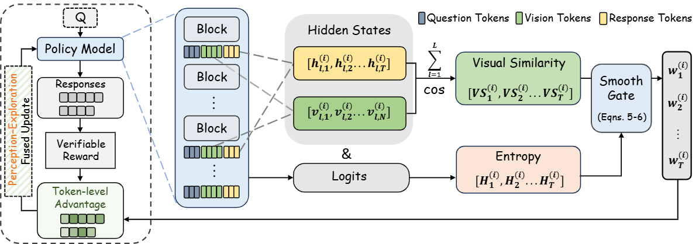
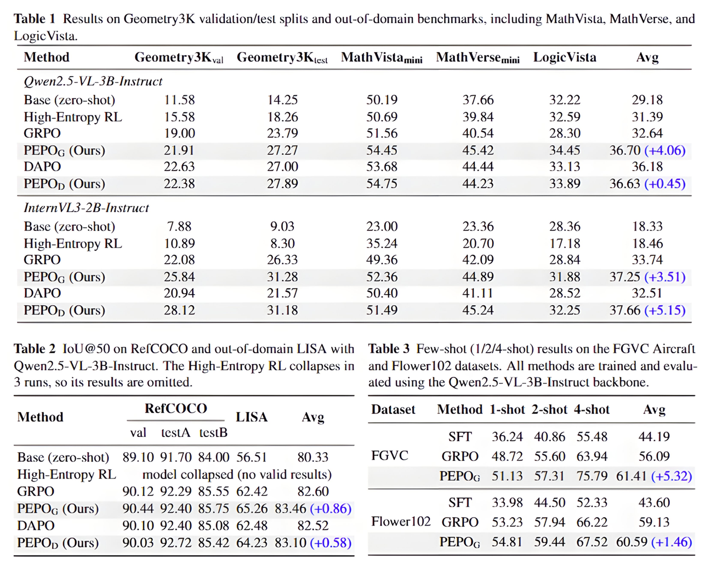

<div align="center">

# Rethinking Token-Level Policy Optimization for Multimodal Chain-of-Thought

</div>

</div>

<div align="center">

<!-- [](https://arxiv.org/abs/) -->
[](https://github.com/xzxxntxdy/PEPO)

</div>

**Perception-Exploration Policy Optimization (PEPO)** is a token-level reinforcement learning method for multimodal chain-of-thought reasoning in large vision-language models.

It derives a **perception prior** from response-to-vision hidden-state similarity, combines it with **token entropy** through a smooth gating mechanism, and converts sequence-level advantages into **token-level advantages** for multimodal RL training.

## **Framework**
<p align="center">
  
</p>

## **Main Results**
<p align="center">
  
</p>

---

## TL;DR

Most multimodal RL methods optimize an entire response with a single sequence-level advantage, even though different reasoning tokens play very different roles.

PEPO improves this by introducing **token-level policy optimization**:

- **Perception**: estimate token-wise visual grounding from hidden-state similarity to vision tokens
- **Exploration**: use token entropy to identify uncertain reasoning steps
- **Fusion**: combine both signals with a smooth gate to produce token weights
- **Optimization**: transform sequence-level advantages into token-level advantages without auxiliary branches or extra supervision

PEPO plugs into standard multimodal RL pipelines such as **GRPO** and **DAPO** with only marginal overhead.

---

## Highlights

- **Token-level perception-exploration weighting** for multimodal RL
- **Compatible with GRPO and DAPO** style training
- **No extra supervision**

---

## Repository Layout

```text
PEPO/
├── assets/                        # README figures
├── data/
│   ├── geometry3k/                # processed JSONL annotations
│   └── raw/                       # raw downloaded datasets
├── scripts/
│   ├── train/                     # training entrypoints
│   └── eval/                      # evaluation entrypoints
├── src/pepo/
│   ├── data/                      # path resolution helpers
│   ├── evaluation/                # evaluation utilities
│   ├── rewards/                   # PEPO reward plugin
│   └── train/                     # PEPO training implementation
└── third_party/ms-swift/          # upstream ms-swift submodule
````

---

## Installation

We recommend **Python 3.10**.

### 1. Create environment

```bash
conda create -n pepo python=3.10
conda activate pepo
```

### 2. Install dependencies

```bash
cd PEPO
git submodule update --init --recursive

# Install the PEPO package. This also installs the pinned ms-swift package
pip install -e .
```

### 3. Optional: Hugging Face mirror

```bash
export HF_ENDPOINT=https://hf-mirror.com
```

---

## Quick Start

### Train PEPO on Geometry3K with Qwen2.5-VL-3B

```bash
export MODEL_ID=Qwen/Qwen2.5-VL-3B-Instruct
bash scripts/train/train_pepo_geometry3k_qwen25vl_3b.sh
```

### Evaluate a trained checkpoint on Geometry3K

```bash
export MODEL_PATH=/path/to/checkpoint-or-merged-model
bash scripts/eval/evaluate_geometry3k.sh
```

---

## Data Preparation

## Geometry3K

The Geometry3K data used in this repository is based on the dataset released by [InterGPS](https://github.com/lupantech/InterGPS).

### 1. Download raw Geometry3K data

Please follow the InterGPS repository instructions to obtain the raw Geometry3K files, and organize them as:

```text
PEPO/data/raw/
└── Geometry3K/
    ├── train/
    ├── val/
    └── test/
```

Expected examples:

```text
data/raw/Geometry3K/train/0/img_diagram.png
data/raw/Geometry3K/val/1000/img_diagram.png
data/raw/Geometry3K/test/2000/img_diagram.png
```

By default, all Geometry3K-related scripts use:

```bash
PEPO/data/raw
```

as the image root.

To override it:

```bash
export GEOMETRY_IMAGE_ROOT=/path/to/data/raw
```

### 2. Processed annotations are already included

This repository already provides the processed Geometry3K annotations used by the training and evaluation scripts:

* [data/geometry3k/train.jsonl](data/geometry3k/train.jsonl)
* [data/geometry3k/val.jsonl](data/geometry3k/val.jsonl)
* [data/geometry3k/test.jsonl](data/geometry3k/test.jsonl)

### Other evaluation datasets

The following evaluation benchmarks are loaded from Hugging Face datasets at runtime:

* `AI4Math/MathVista`
* `AI4Math/MathVerse`
* `lscpku/LogicVista`

By default, cached files are stored in:

```bash
PEPO/.cache/hf/
```

To change the cache location:

```bash
export CACHE_DIR=/path/to/cache
```

---

## Training

This release includes four Geometry3K training recipes:

* **Qwen2.5-VL-3B + PEPO**
* **Qwen2.5-VL-3B + PEPO_D**
* **InternVL3-2B + PEPO**
* **InternVL3-2B + PEPO_D**

All entrypoints are under [scripts/train](scripts/train).

### Qwen2.5-VL-3B-Instruct

Use the Qwen model id:

```bash
export MODEL_ID=Qwen/Qwen2.5-VL-3B-Instruct
```

Run `PEPO_G`:

```bash
bash scripts/train/train_pepo_geometry3k_qwen25vl_3b.sh
```

The training scripts call `python -m pepo.train.rlhf`, while reusing `ms-swift` as the underlying framework dependency.

Run `PEPO_D`:

```bash
bash scripts/train/train_pepo_d_geometry3k_qwen25vl_3b.sh
```

### InternVL3-2B-Instruct

Use the InternVL model id:

```bash
export MODEL_ID=OpenGVLab/InternVL3-2B-Instruct
```

Run `PEPO_G`:

```bash
bash scripts/train/train_pepo_geometry3k_internvl3_2b.sh
```

Run `PEPO_D`:

```bash
bash scripts/train/train_pepo_d_geometry3k_internvl3_2b.sh
```

### Optional logging

To enable SwanLab logging:

```bash
export SWANLAB_TOKEN=your_token
```

---

## Evaluation

All evaluation scripts are under [scripts/eval](scripts/eval).

### Geometry3K

```bash
export MODEL_PATH=/path/to/checkpoint-or-merged-model
bash scripts/eval/evaluate_geometry3k.sh
```

Example with overrides:

```bash
BON_N=8 \
GROUP_SIZE=256 \
OUTPUT_PATH=results/geometry3k/my_run.json \
bash scripts/eval/evaluate_geometry3k.sh
```

### MathVista

```bash
export MODEL_PATH=/path/to/checkpoint-or-merged-model
bash scripts/eval/evaluate_mathvista.sh
```

### MathVerse

```bash
export MODEL_PATH=/path/to/checkpoint-or-merged-model
bash scripts/eval/evaluate_mathverse.sh
```

By default, the wrapper evaluates only choice-based samples.

To disable that filter:

```bash
ONLY_CHOICE_QUESTIONS=false bash scripts/eval/evaluate_mathverse.sh
```

### LogicVista

```bash
export MODEL_PATH=/path/to/checkpoint-or-merged-model
bash scripts/eval/evaluate_logicvista.sh
```

---

## Method Summary

PEPO is motivated by a simple observation: in multimodal chain-of-thought reasoning, not all tokens should receive the same optimization signal.

Successful reasoning trajectories exhibit two complementary properties:

* **Visually grounded tokens** anchor reasoning to image evidence
* **High-entropy tokens** often correspond to uncertain or exploratory reasoning transitions

PEPO models these two factors jointly:

1. Compute token-wise **visual similarity** between response tokens and vision tokens from hidden states
2. Compute token-wise **entropy** from output logits
3. Fuse them with a smooth gate to obtain token weights
4. Use these weights to refine sequence-level advantages into **token-level advantages**

This produces a lightweight token-level optimization mechanism that can be applied on top of existing RLVR training frameworks.

---

## Main Files

The main PEPO-related implementation is concentrated in:

* [src/pepo/rewards/plugin.py](src/pepo/rewards/plugin.py)
* [src/pepo/train/args.py](src/pepo/train/args.py)
* [src/pepo/train/grpo_trainer.py](src/pepo/train/grpo_trainer.py)
* [src/pepo/train/rlhf.py](src/pepo/train/rlhf.py)
* [scripts/train/train_pepo_geometry3k_qwen25vl_3b.sh](scripts/train/train_pepo_geometry3k_qwen25vl_3b.sh)
* [third_party/ms-swift](third_party/ms-swift)

---

## Experimental Scope in This Release

The current public code focuses on the Geometry3K-centered training/evaluation pipeline described above.

The paper additionally reports experiments on:

* visual grounding
* visual puzzle reasoning
* few-shot classification
* scaling experiments on larger multimodal reasoning data

---

## Acknowledgements

We thank the [ms-swift](https://github.com/modelscope/ms-swift) team for providing the underlying multimodal RLHF framework used in this project.

---

<!-- ## Citation

If you find this repository useful, please cite the PEPO paper:

```bibtex
@article{pepo,
  title={Rethinking Token-Level Policy Optimization for Multimodal Chain-of-Thought},
  author={...},
  journal={arXiv preprint},
  year={2026}
}
``` -->

---

## License

This repository contains:

* PEPO-specific code
* an `ms-swift` git submodule pinned by the parent repository

Please check the original license files in [third_party/ms-swift](third_party/ms-swift) before redistribution or commercial use.
